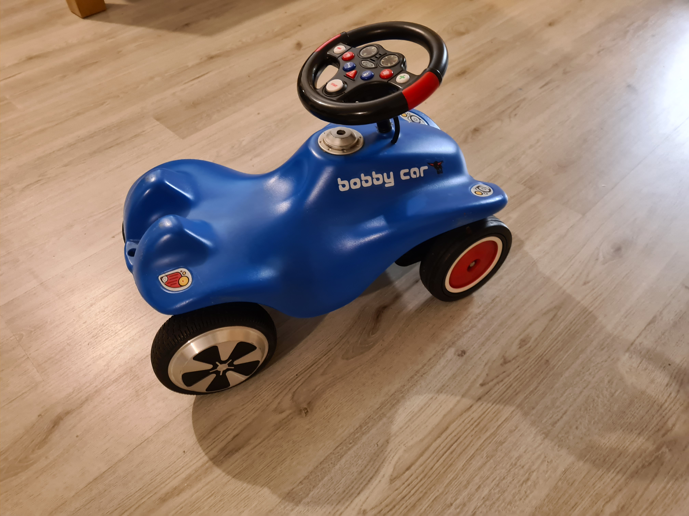

# BobbyCar

Micropython based control software for a BobbyCar electrification.

<table>
 <tr>
  <td></td>
  <td></td> 
 </tr>
 <tr>
  <td colspan="2"></td>
 </tr>
</table>

Components: 
 - [Big Bobby car](doc/img/big_bobbycar.png)
 - [Big Steering wheel](doc/img/big_wheel.png)
 - STM32F4Discovery board, [micropython firmware](firmware)
 - Hoverboard with UART mode custom firmware ([EmanuelFeru](firmware/hoverboard-firmware-hack-FOC))
 
Features:
  - Smoothened acceleration deceleration
  - Emergency breaker (Warn button)
  - Virtual gearbox
  - Power on with start button (hardwired)
  - 3 minutes auto turn-off

Instructions:
 - Prepare wheel construction to clamp the frame, it's thickest on the bottom
 - Flash UART mode custome firmware to the hoverboard using the ST-Link on the STM32F4Discovery
 - Flash STM32F4Discovery with [STM32CubeProgrammer](https://www.st.com/en/development-tools/stm32cubeprog.html), keep reset button pressed if it won't connect
 - Place python files on the PYBFLASH using the Micro USB port on the STM32F4Discovery
 - Solder wires to each of the buttons positive side (measure relative to ground) and old scart cable is ideal and connect wires to STM32F4Discovery pins (except start button)
 - Wire start button seperately to the Hoverboard power switch pins
 - Use an old gyro sensor board of the hoverboard to tap 5V and GRND for powering the STM32F4Discovery
