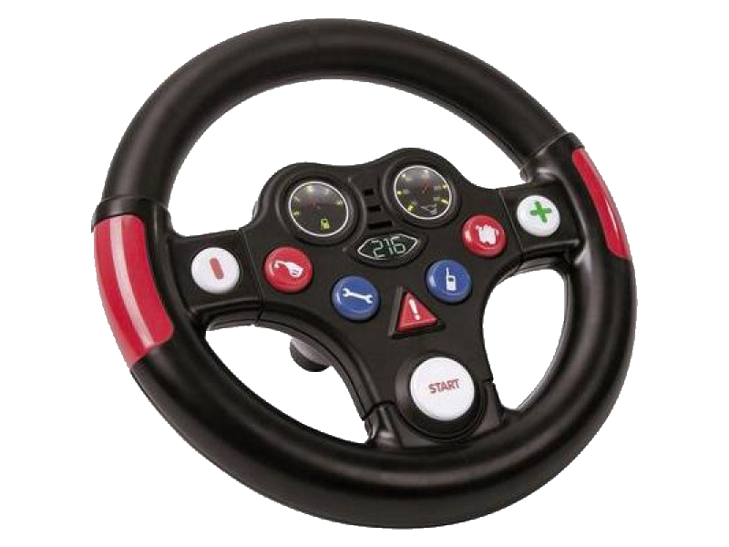

# BobbyCar

Micropython based control software for a BobbyCar electrification.

| Bobby Car  | Wheel       |
|------------|-------------|
|  |  |

Components: 
 - [Big Bobby car](https://github.com/JohnieBraaf/BobbyCar/tree/main/doc/img/big_bobbycar.png)
 - [Big Steering wheel](https://github.com/JohnieBraaf/BobbyCar/tree/main/doc/img/big_wheel.png)
 - STM32F4Discovery board, [micropython firmware](firmware)
 - Hoverboard with UART mode custom firmware ([EmanuelFeru](https://github.com/JohnieBraaf/BobbyCar/tree/main/firmware/hoverboard-firmware-hack-FOC))
 
Features:
  - Smoothened acceleration deceleration
  - Emergency breaker (Warn button)

